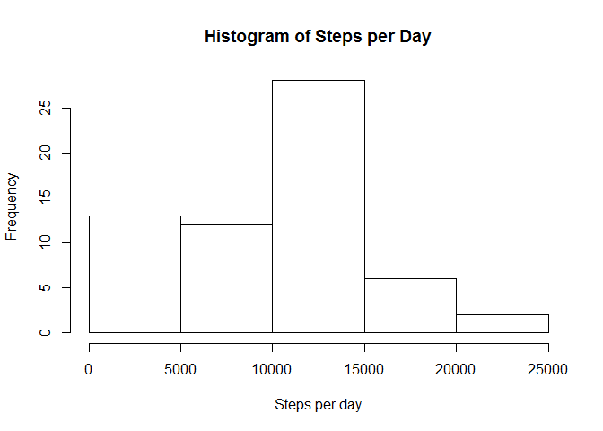
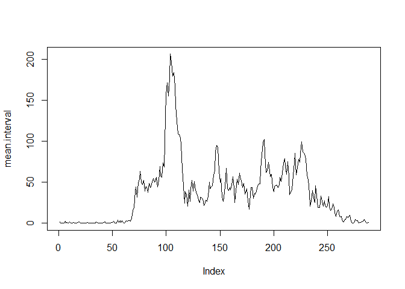
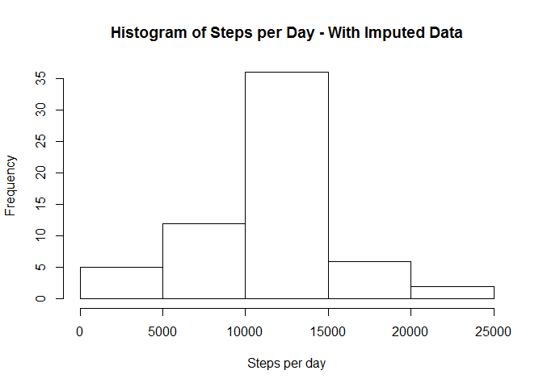
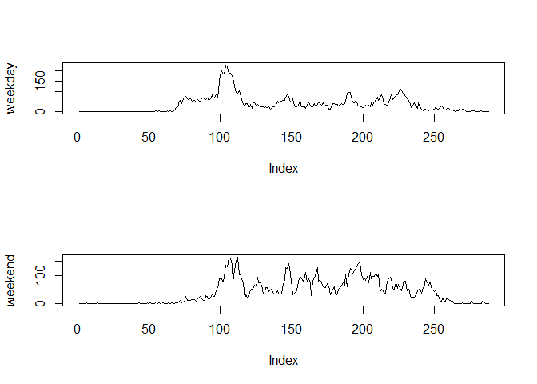

# Reproducible Research: Peer Assessment 1


## Loading and preprocessing the data


```r
library(ggplot2)
setwd("C:/Coursera/Reproducible Research/RepData_PeerAssessment1")
raw.data <- read.csv(unz("activity.zip", "activity.csv"), colClasses = c("integer", "Date", "integer"))
raw.data$interval <- sprintf("%02d:%02d - %02d:%02d", 
                             raw.data$interval %/% 100, raw.data$interval %% 100,
                             raw.data$interval %/% 100, raw.data$interval %% 100 + 4)
```


## What is mean total number of steps taken per day?


```r
sum.day <- tapply(raw.data$steps, raw.data$date, sum, na.rm = T)
hist(sum.day, xlab = "Steps per day", main = "Histogram of Steps per Day")
```

 

```r
mean(sum.day)
```

```
## [1] 9354.23
```

```r
median(sum.day)
```

```
## [1] 10395
```


## What is the average daily activity pattern?


```r
mean.interval <- tapply(raw.data$steps, raw.data$interval, mean, na.rm = T)
plot(mean.interval, type = "l")
```

 

```r
names(which(mean.interval == max(mean.interval)))
```

```
## [1] "08:35 - 08:39"
```
The 8:35-8:39 am interval has the most steps on average.

## Imputing missing values
Replace all NA values with the median for the time interval.


```r
# median.interval <- tapply(raw.data$steps, raw.data$interval, median, na.rm = T)
imputed.data <- raw.data
nas <- is.na(imputed.data$steps)
imputed.data[nas, "steps"] <- mean.interval[imputed.data[nas, "interval"]]

sum.day2 <- tapply(imputed.data$steps, imputed.data$date, sum)
hist(sum.day2, xlab = "Steps per day", main = "Histogram of Steps per Day - With Imputed Data")
```

 

```r
mean(sum.day2)
```

```
## [1] 10766.19
```

```r
median(sum.day2)
```

```
## [1] 10766.19
```
Both the mean and the median for the daily number of steps increase somewhat after the missing values are imputed.

## Are there differences in activity patterns between weekdays and weekends?


```r
imputed.data$weekday <- "weekday"
imputed.data[weekdays(imputed.data$date) %in% c("Saturday", "Sunday"), "weekday"] <- "weekend"
imputed.data$weekday <- as.factor(imputed.data$weekday)

mean.interval2 <- sapply(split(imputed.data, imputed.data$weekday), 
                         function(i) tapply(i$steps, i$interval, mean))
mean.interval2 <- data.frame(with(imputed.data, tapply(steps, list(interval, weekday), mean)))

par(mfrow = c(2,1))

plot(mean.interval2$weekday, type = "l", ylab = "weekday")
plot(mean.interval2$weekend, type = "l", ylab = "weekend")
```

 

